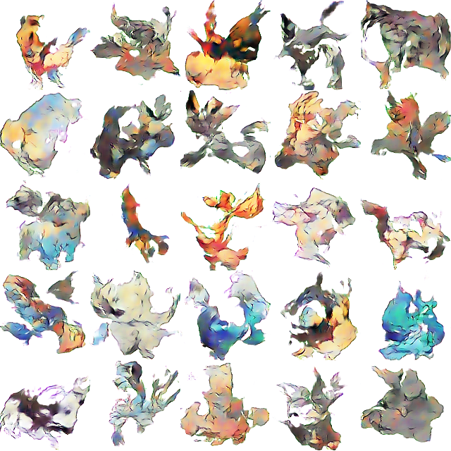
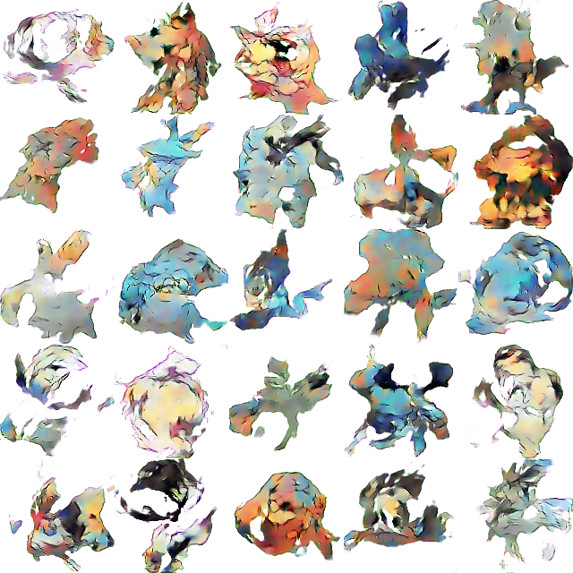
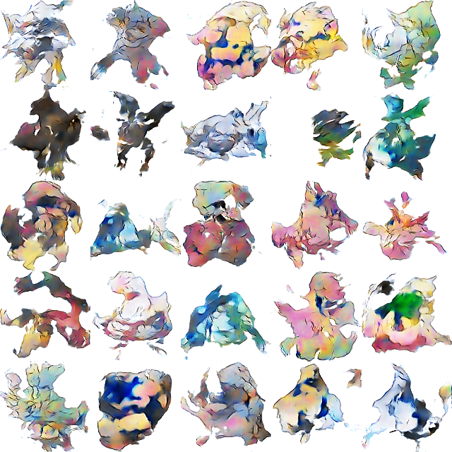
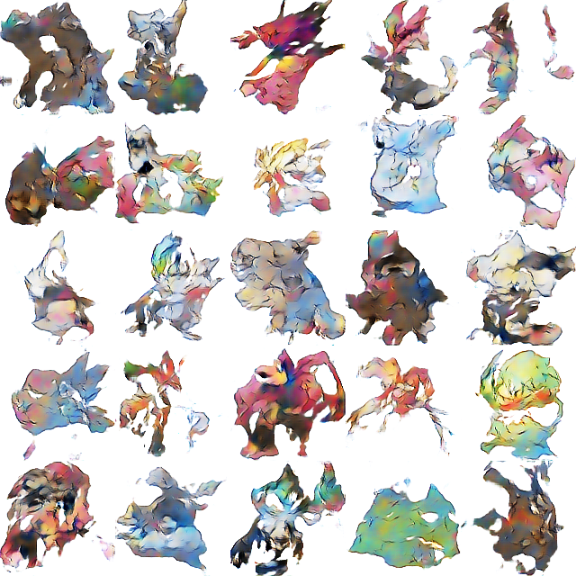
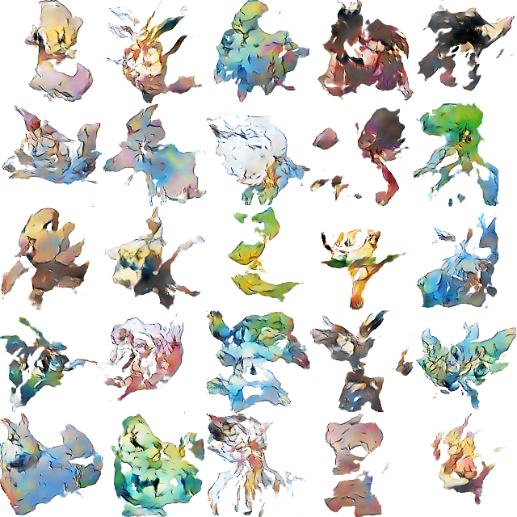

# Pokemon Incubator

## Train

1. Save training images to folder `training-data`

2. Run training script

```bash
python train.py --epochs=100 --batch-size=32 \
    --sample-interval=50 --load-saved=True --method=wgangp
```

## Example Results







## Credits

The code [wgan](wgan/wgan.py) and [wgangp](wgangp/wgangp.py) are taken and modified 
from [Keras-GAN](https://github.com/eriklindernoren/Keras-GAN).

<details>
<summary>Why not fork?</summary>
It's a great repo to fork and start with, but there are too many GAN implementations that we are not going
to use. So we copied the code we need and modified them for our training sets.
</details><br/><br/>

[utils](utils.py) is taken and modified from 
[Pokemon_GAM](https://github.com/llSourcell/Pokemon_GAN/blob/master/utils.py).

<details>
<summary>Why not fork?</summary>
Again, a great repo that taught us a lot, but we wanted to try different algorithms to train our data.
</details>
